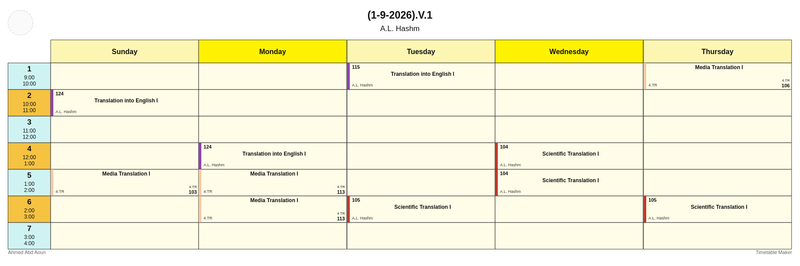

# Timetable Maker

A professional, click-to-edit class timetable builder for Windows. Build a
weekly schedule — subjects, times, hall numbers, instructors — visually,
then export it as a polished JPG or PNG image to share or print.

> ☀️ **Always light.** There is no dark mode anywhere in this app — window
> chrome, dialogs, and the timetable itself are permanently light and
> professional-looking, by design.

---

## Features

- **Click directly on the timetable to edit it** — no separate "edit mode."
  Click the title to rename it, click the logo to change it, click a day
  header to rename/recolor/reorder/delete that day, click a period's time
  label to edit it, and click any cell to add or edit a class.
- Each class card shows **subject, hall/room number, instructor or group,
  and an optional secondary section tag** (e.g. a lab/tutorial room),
  with a colored accent bar you choose from a curated palette or any
  custom color.
- **Conflict detection** — you can't accidentally double-book a day/period;
  the app tells you what's already there.
- Fully editable **periods** (add/edit/delete/reorder time rows) and
  **days** (add/edit/delete/reorder columns, each with its own header
  color) — not locked to any fixed schedule shape.
- **Export as JPG or PNG** at high resolution, using the exact same
  rendering code as the live on-screen view — what you see is what you get.
- **Custom logo** support (top-left), plus editable title and footer text.
- **Autosaves on every change** using the same crash-safe atomic-write +
  rolling-backup approach as our other tools — plus explicit **Save As**
  and **Open** for named timetable files you want to keep separately.

---

## Requirements

- Windows 10/11 (to run the built `.exe`)
- Python 3.12+ (only needed to run from source or build the `.exe` yourself)

---

## Installation / Running from Source

```powershell
git clone https://github.com/<your-username>/timetable-maker.git
cd timetable-maker

python -m venv .venv
.venv\Scripts\activate

pip install -r requirements.txt
python -m app.main
```

On first launch you get a ready-to-use blank grid (Sunday–Thursday,
7 periods from 9:00–4:00) — just start clicking cells to fill it in.
Your work is saved automatically to `%APPDATA%\TimetableMaker\`.

To try it with a working example first, use **Open...** and pick
`examples/sample_timetable.json` — it's a filled-in sample matching the
style below.



---

## How to Use

| Click on... | What happens |
|---|---|
| An empty cell | Add a class (subject, hall, instructor, optional section tag, color) |
| A filled cell | Edit that class, or delete it |
| A day header (e.g. "Monday") | Rename it, recolor it, reorder it, or delete it |
| A period's time label | Edit its label/start/end time, reorder it, or delete it |
| The title text | Edit both title lines |
| The logo circle | Add, change, or remove a logo image |

Toolbar buttons cover the rest: **New**, **Open...**, **Save As...**,
**Export as Image...**, and dedicated **Manage Periods...** / **Manage
Days...** dialogs for bulk reordering.

---

## Data Safety

Every edit autosaves immediately using an atomic write (temp file → flush
→ rolling backup → atomic rename), so a crash mid-save can't corrupt your
data, and the app automatically recovers from the backup if the primary
file is ever unreadable. Malformed entries in a hand-edited file are
skipped individually rather than taking down the whole timetable. Data
lives in `%APPDATA%\TimetableMaker\current_timetable.json`.

---

## Project Structure

```text
timetable-maker/
├── app/
│   ├── main.py                 # Entry point
│   ├── config.py                # Constants, default grid, accent palette
│   ├── models/
│   │   └── timetable.py         # Period, Day, Entry, Timetable — defensive (de)serialization
│   ├── services/
│   │   └── storage.py           # Atomic save/load, Save As / Open
│   ├── ui/
│   │   ├── main_window.py       # Toolbar + wiring
│   │   ├── canvas.py            # The custom-painted, clickable timetable grid
│   │   ├── export_service.py    # Renders the canvas to JPG/PNG
│   │   ├── entry_dialog.py      # Add/Edit class dialog
│   │   ├── periods_dialog.py    # Manage periods
│   │   ├── days_dialog.py       # Manage days
│   │   ├── meta_dialog.py       # Title/footer/logo
│   │   └── style.py             # The one permanent light stylesheet
│   └── utils/                    # Logging, app-data paths
├── tests/
│   ├── test_models.py
│   ├── test_storage.py
│   └── test_canvas.py            # Rendering correctness + export, needs PySide6
├── requirements.txt
├── requirements-dev.txt
├── build.py                      # PyInstaller build script -> dist/TimetableMaker.exe
├── .github/workflows/build.yml   # CI: tests + builds .exe, releases on tags
└── README.md
```

---

## Building the standalone .exe

### Locally, on Windows
```powershell
pip install -r requirements-dev.txt
python build.py
```
Produces `dist/TimetableMaker.exe` — runs on any Windows 10/11 PC without
requiring Python.

### Via GitHub Actions
`.github/workflows/build.yml` runs automatically on every push/PR to
`main`, and can be triggered manually (**Actions → Build → Run
workflow**). It installs dependencies, runs the full test suite
(headlessly, via `QT_QPA_PLATFORM=offscreen`), builds `TimetableMaker.exe`,
and uploads it as a downloadable artifact.

To cut a release with the `.exe` attached to the Releases page:
```powershell
git tag v1.0.0
git push origin v1.0.0
```

---

## Running the tests

```powershell
pip install -r requirements-dev.txt
pytest tests/ -v
```

`tests/test_canvas.py` specifically checks that every day header, period
row, and cell renders in its *exact* configured color by sampling actual
pixels from a rendered image — this is a regression test for a real bug
caught during development (a stray paint "brush" was silently overwriting
every cell's color with flat gray), so it can never silently reappear.

## License

MIT — see [LICENSE](LICENSE).
